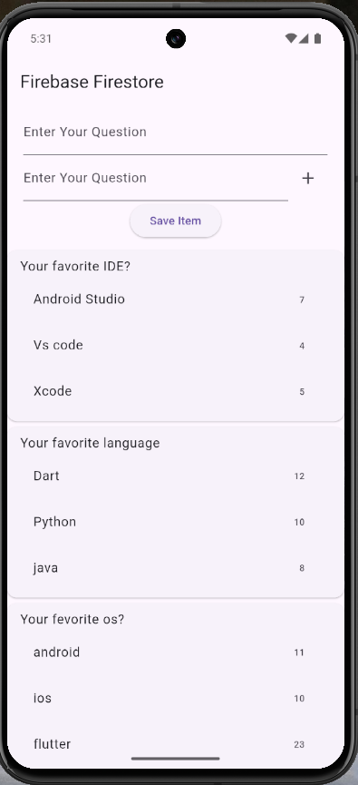

# Firebase Voting App

## Overview

This is a simple voting app built with Flutter and Firebase (Cloud Firestore). The app lets users:

* **Create** a new voting poll (title + options)
* **Vote** on an existing poll (increase option counts)
* **Delete** old polls

Below you will find setup instructions, usage notes, Firestore structure, and some example code snippets.

---

## Demo



> Make sure the image file is present at `assets/image/img.png` and declared in `pubspec.yaml` under the `assets:` section so it shows in the README and the app.

---

## Features

* Add a new poll with any number of options
* Cast a vote for a specific option (atomic update)
* Remove a poll from the database
* Uses Cloud Firestore as the backend for real-time updates

---

## Prerequisites

* Flutter SDK installed (stable channel)
* A Firebase project (console.firebase.google.com)
* `cloud_firestore` and `firebase_core` packages added to `pubspec.yaml`

Example `pubspec.yaml` dependencies:

```yaml
dependencies:
  flutter:
    sdk: flutter
  firebase_core: ^2.0.0
  cloud_firestore: ^4.0.0
```

---

## Firebase setup (high level)

1. Create a Firebase project at the Firebase console.
2. Add an Android and/or iOS app to the Firebase project.

    * For Android: download `google-services.json` and place it in `android/app/`.
    * For iOS: download `GoogleService-Info.plist` and add it to Xcode project.
3. Enable **Cloud Firestore** in the console and start in test mode (adjust rules later for production).
4. Add Firebase SDK initialization to your Flutter app (see `main.dart` example below).

### Firestore structure (suggested)

Collection: `polls`

Document (pollId):

```json
{
  "title": "Which is your favorite fruit?",
  "options": {
    "Apple": 5,
    "Banana": 3,
    "Mango": 8
  },
  "created_at": <timestamp>
}
```

This structure keeps option labels as keys and vote counts as integer values.

---

## Code examples

### Initialize Firebase (main.dart)

```dart
import 'package:flutter/material.dart';
import 'package:firebase_core/firebase_core.dart';

void main() async {
  WidgetsFlutterBinding.ensureInitialized();
  await Firebase.initializeApp();
  runApp(MyApp());
}
```

### Add a new poll

```dart
import 'package:cloud_firestore/cloud_firestore.dart';

Future<void> createPoll(String title, List<String> options) async {
  final Map<String,int> optionsMap = {
    for (var o in options) o: 0
  };

  await FirebaseFirestore.instance.collection('polls').add({
    'title': title,
    'options': optionsMap,
    'created_at': FieldValue.serverTimestamp(),
  });
}
```

### Cast a vote (atomic increment)

Use `FieldValue.increment(1)` inside a transaction or update to avoid race conditions.

```dart
Future<void> vote(String pollId, String optionLabel) async {
  final docRef = FirebaseFirestore.instance.collection('polls').doc(pollId);

  // Transaction ensures safe concurrent updates
  await FirebaseFirestore.instance.runTransaction((tx) async {
    final snapshot = await tx.get(docRef);
    if (!snapshot.exists) throw Exception('Poll not found');

    final options = Map<String, dynamic>.from(snapshot.get('options'));
    if (!options.containsKey(optionLabel)) throw Exception('Option not found');

    // Use map update + tx.update
    options[optionLabel] = (options[optionLabel] ?? 0) + 1;
    tx.update(docRef, {'options': options});
  });
}
```

Alternatively, you can call `FieldValue.increment(1)` using a nested map path if your option keys are safe as map keys.

### Delete a poll

```dart
Future<void> deletePoll(String pollId) async {
  await FirebaseFirestore.instance.collection('polls').doc(pollId).delete();
}
```

---

## Displaying polls in the app

Use a `StreamBuilder` on `FirebaseFirestore.instance.collection('polls').snapshots()` to show live updates. Map each document to a UI card showing the poll title and the options with vote counts and a button to vote.

---

## pubspec.yaml — include the image asset

```yaml
flutter:
  assets:
    - assets/image/img.png
```

Make sure the file path matches exactly (case-sensitive on some systems).

---

## Security Rules (development example)

**WARNING:** Only use test rules during development. Update rules before publishing.

```text
rules_version = '2';
service cloud.firestore {
  match /databases/{database}/documents {
    match /polls/{pollId} {
      allow read: if true;
      // Allow create if authenticated (or true for development)
      allow create: if true;
      // Allow update only to increment vote counts or by owner
      allow update: if true;
      allow delete: if request.auth != null; // require authentication for delete
    }
  }
}
```

---

## Troubleshooting

* If the app can't find Firestore, ensure `google-services.json` / `GoogleService-Info.plist` is added and Firebase is initialized.
* If the image doesn't display in the README or app, check the asset path in `pubspec.yaml` and the actual file location.
* For permission or rules errors, check Firestore rules and console logs.

---

## Next steps / Improvements

* Add authentication (Firebase Auth) so only authorized users can create or delete polls.
* Add user-based vote tracking to prevent multiple votes per user.
* Move option counts to subcollection documents if you expect many options or very high concurrency.

---

If you want, I can also prepare a `README.md` file with slightly different wording, or include full example UI code (poll list screen, create poll form). Tell me which you prefer.

